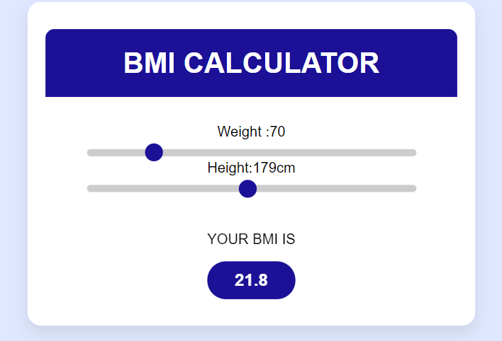

# 🧮 BMI Calculator - ReactJS

A sleek and responsive **Body Mass Index (BMI) Calculator** built using **ReactJS**, designed to help users instantly calculate their BMI based on height and weight inputs. This project is perfect for beginners and intermediates looking to learn or practice core React concepts.

---

## 📸 Preview

 <!-- Replace with your actual screenshot file -->

---

## 📌 Features

- ✅ Real-time BMI calculation
- ✅ Categorizes BMI (Underweight, Normal, Overweight, Obese)
- ✅ Clean and responsive UI (Mobile-friendly)
- ✅ Built with reusable functional components
- ✅ React Hooks (`useState`) for managing state
- ✅ Easy to use and understand for all users

---

## 🛠 Tech Stack

| Tech            | Description                          |
|-----------------|--------------------------------------|
| **ReactJS**     | Frontend framework                   |
| **JavaScript**  | Programming language for logic       |
| **HTML5**       | Structure of the app                 |
| **CSS3**        | Styling and layout                   |

---

## 📂 Project Structure

